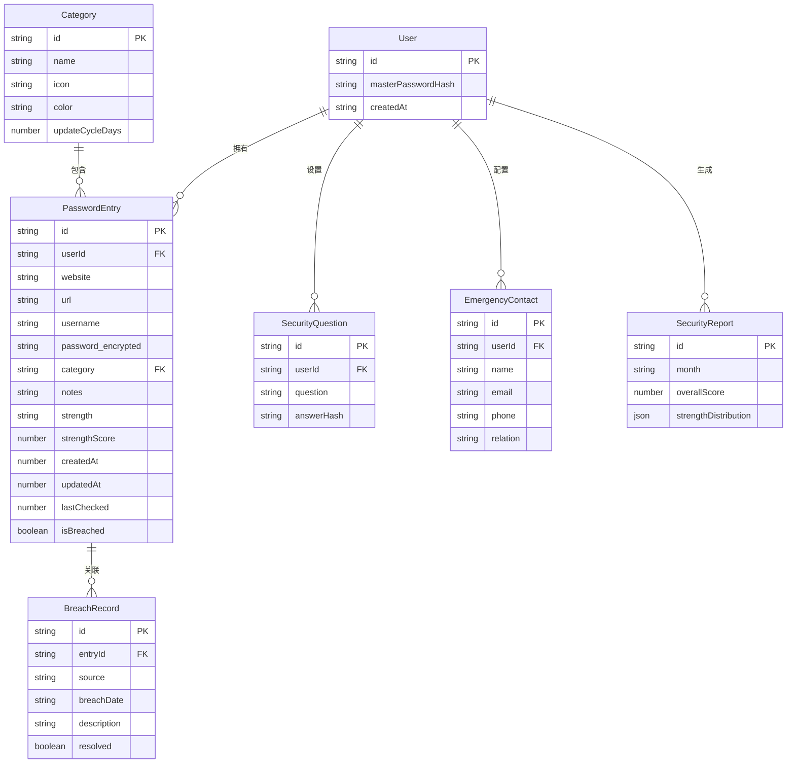

## 1. 架构设计

```mermaid
graph TB
    subgraph "前端层"
        "React 18 应用"
        "Tailwind CSS 样式"
        "Zustand 状态管理"
        "React Router 路由"
    end
    subgraph "数据层"
        "localStorage 持久化"
        "CryptoJS 加密引擎"
        "Mock泄露检测库"
    end
    subgraph "工具模块"
        "密码强度评估器"
        "密码生成器"
        "周期提醒引擎"
        "报告生成器"
    end
    "React 18 应用" --> "Zustand 状态管理"
    "Zustand 状态管理" --> "localStorage 持久化"
    "React 18 应用" --> "密码强度评估器"
    "React 18 应用" --> "密码生成器"
    "React 18 应用" --> "周期提醒引擎"
    "React 18 应用" --> "报告生成器"
    "Zustand 状态管理" --> "CryptoJS 加密引擎"
    "React 18 应用" --> "React Router 路由"
```

## 2. 技术说明

- **前端框架**：React@18 + TypeScript
- **样式方案**：Tailwind CSS@3 + CSS Variables（主题色）
- **构建工具**：Vite
- **状态管理**：Zustand（轻量级、支持持久化中间件）
- **路由**：React Router@6
- **加密**：CryptoJS（AES加密存储密码数据）
- **图表**：Recharts（安全报告可视化）
- **PDF导出**：jsPDF + jspdf-autotable（生成加密PDF报告）
- **图标**：Lucide React
- **动画**：Framer Motion
- **后端**：无（纯前端应用，数据加密存储在localStorage）
- **数据库**：localStorage + Zustand persist中间件

## 3. 路由定义

| 路由 | 用途 |
|------|------|
| / | 登录/主密码验证页 |
| /vault | 密码库主页（安全概览 + 密码列表） |
| /vault/add | 添加新密码条目 |
| /vault/edit/:id | 编辑密码条目 |
| /generator | 密码生成器 |
| /categories | 分类管理 |
| /breach-detect | 泄露检测 |
| /reports | 安全报告 |
| /settings | 设置页 |

## 4. API定义

无后端API，使用前端本地数据管理。核心数据操作通过Zustand store实现：

```typescript
interface PasswordEntry {
  id: string
  website: string
  url: string
  username: string
  password: string
  category: string
  notes: string
  strength: 'weak' | 'medium' | 'strong' | 'very-strong'
  strengthScore: number
  createdAt: number
  updatedAt: number
  lastChecked: number
  isBreached: boolean
  breachInfo?: BreachInfo
}

interface Category {
  id: string
  name: string
  icon: string
  color: string
  updateCycleDays: number
  accountCount: number
}

interface BreachInfo {
  source: string
  breachDate: string
  description: string
}

interface SecurityReport {
  month: string
  overallScore: number
  strengthDistribution: Record<string, number>
  breachEvents: BreachEvent[]
  updateRecords: UpdateRecord[]
}

interface UserSettings {
  masterPasswordHash: string
  securityQuestions: SecurityQuestion[]
  emergencyContacts: EmergencyContact[]
  notifications: NotificationSettings
}

interface SecurityQuestion {
  question: string
  answerHash: string
}

interface EmergencyContact {
  name: string
  email: string
  phone: string
  relation: string
}

interface NotificationSettings {
  breachAlert: boolean
  updateReminder: boolean
  reminderDaysBefore: number
}
```

## 5. 服务端架构图

不适用（纯前端应用）

## 6. 数据模型

### 6.1 数据模型定义



### 6.2 数据定义语言

使用localStorage存储，数据结构以JSON形式组织：

```sql
-- 逻辑数据结构（实际存储为加密JSON）

CREATE TABLE categories (
  id TEXT PRIMARY KEY,
  name TEXT NOT NULL,
  icon TEXT NOT NULL,
  color TEXT NOT NULL,
  update_cycle_days INTEGER DEFAULT 90
);

CREATE TABLE password_entries (
  id TEXT PRIMARY KEY,
  website TEXT NOT NULL,
  url TEXT,
  username TEXT NOT NULL,
  password_encrypted TEXT NOT NULL,
  category_id TEXT REFERENCES categories(id),
  notes TEXT,
  strength TEXT CHECK(strength IN ('weak','medium','strong','very-strong')),
  strength_score INTEGER CHECK(strength_score BETWEEN 0 AND 100),
  created_at INTEGER NOT NULL,
  updated_at INTEGER NOT NULL,
  last_checked INTEGER,
  is_breached BOOLEAN DEFAULT FALSE
);

CREATE TABLE breach_records (
  id TEXT PRIMARY KEY,
  entry_id TEXT REFERENCES password_entries(id),
  source TEXT NOT NULL,
  breach_date TEXT NOT NULL,
  description TEXT,
  resolved BOOLEAN DEFAULT FALSE
);

-- 预置分类数据
INSERT INTO categories VALUES ('cat-finance', '金融', 'landmark', '#00D68F', 30);
INSERT INTO categories VALUES ('cat-social', '社交', 'users', '#3B82F6', 90);
INSERT INTO categories VALUES ('cat-work', '工作', 'briefcase', '#A855F7', 60);
INSERT INTO categories VALUES ('cat-shopping', '购物', 'shopping-cart', '#F59E0B', 90);
INSERT INTO categories VALUES ('cat-entertainment', '娱乐', 'gamepad-2', '#EC4899', 180);
INSERT INTO categories VALUES ('cat-other', '其他', 'folder', '#6B7280', 180);
```
